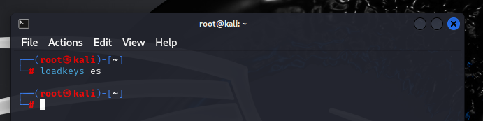

# Tarea 2.3: Montado de un sistema de ficheros con chroot

## Descripción

Esta práctica utiliza una máquina base Debian y una imagen .iso de Kali Linux para recuperar un usuario y contraseña. El proceso implica montar particiones, configurar un entorno chroot y recuperar el sistema.

## Procedimiento


### 1. Instalación de la máquina virtual

- Se instala Debian desde cero.
- Se crea un usuario con tu nombre personal.


### 2. Configuración en VirtualBox

- Se añade la imagen de Kali Linux en almacenamiento.
- Se configura el orden de arranque priorizando el arranque óptico.


### 3. Arranque con Kali Linux Live

- Se inicia la máquina y arranca Kali Linux en modo live.


### 4.1 Cambio de teclado a español


```bash
loadkeys es
```




### 4.2 Acceso como root


```bash
sudo su
```


### 4.3 Mostrar sistemas de ficheros montados


```bash
df -h
```


### 4.4 Listar la tabla de particiones


```bash
fdisk -l /dev/sda
```


### 4.5 Crear directorio de montaje


```bash
mkdir /mnt/recuperar
```


### 4.6 Montar la partición


```bash
mount -t auto /dev/sda1 /mnt/recuperar
```


### 4.7 Montar /dev


```bash
mount --bind /dev /mnt/recuperar/dev
```


### 4.8 Montar /proc


```bash
mount --bind /proc /mnt/recuperar/proc
```


### 4.9 Montar /sys


```bash
mount --bind /sys /mnt/recuperar/sys
```


### 4.10 Crear jaula chroot


```bash
chroot /mnt/recuperar
```


### 4.11 Desmontar sistemas montados


```bash
umount /mnt/recuperar/dev
umount /mnt/recuperar/proc
umount /mnt/recuperar/sys
umount /mnt/recuperar
```


### 4.12 Eliminar la ISO y arrancar Debian normalmente

- Se elimina la ISO de la configuración de VirtualBox.
- Se arranca el sistema Debian de manera habitual.


### 4.12 Eliminar la ISO y arrancar Debian normalmente

- Se elimina la ISO de la configuración de VirtualBox.
- Se arranca el sistema Debian de manera habitual.
